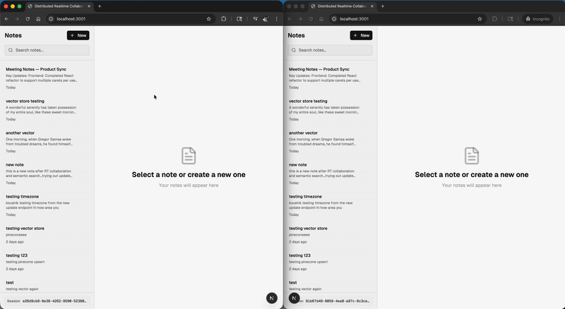

# Distributed Realtime Collaboration System (2025)



A collaborative editor built for real-time, multi-user editing with semantic search support. This system leverages **Operational Transform (OT)** for conflict-free synchronization across distributed sessions and **Retrieval-Augmented Generation (RAG)** for context-aware document retrieval.

---

## Features

- **Real-time Collaboration:** Multiple users can edit documents simultaneously with OT ensuring consistency and conflict resolution.
- **Semantic Search (RAG):** Context-aware document retrieval powered by Retrieval-Augmented Generation for smarter collaboration.
- **Scalable Backend:** Built with Express and MongoDB for handling concurrent users and large document data.
- **Frontend:** React-based UI with live updates, highlighting, and seamless user experience.

---

## Tech Stack

- **Frontend:** React
- **Backend:** Express.js
- **Database:** PostgreSQL + Pinecone (To Store Vectors)
- **Real-time Sync:** Operational Transform (OT)
- **Semantic Search:** Retrieval-Augmented Generation (RAG)
- **Deployment:** TBD (Probably Vercel + AWS)

---

## Architecture Overview

1. **Frontend:**  
   - React app with rich text editor
   - WebSocket integration for live collaboration

2. **Backend:**  
   - Express server handling WebSocket connections  
   - Operational Transform for conflict-free edits  
   - RAG integration to perform semantic search and contextual suggestions

3. **Database:**  
   - PostgreSQL stores user data, documents, and OT operation history
   - Extension pgVectors store the semantic embeddings

---

## Getting Started

### Prerequisites

- Node.js >= 18.x
- MongoDB
- Yarn or npm

### Installation

```bash
git clone https://github.com/your-username/distributed-collab-system.git
cd distributed-collab-system
npm install
